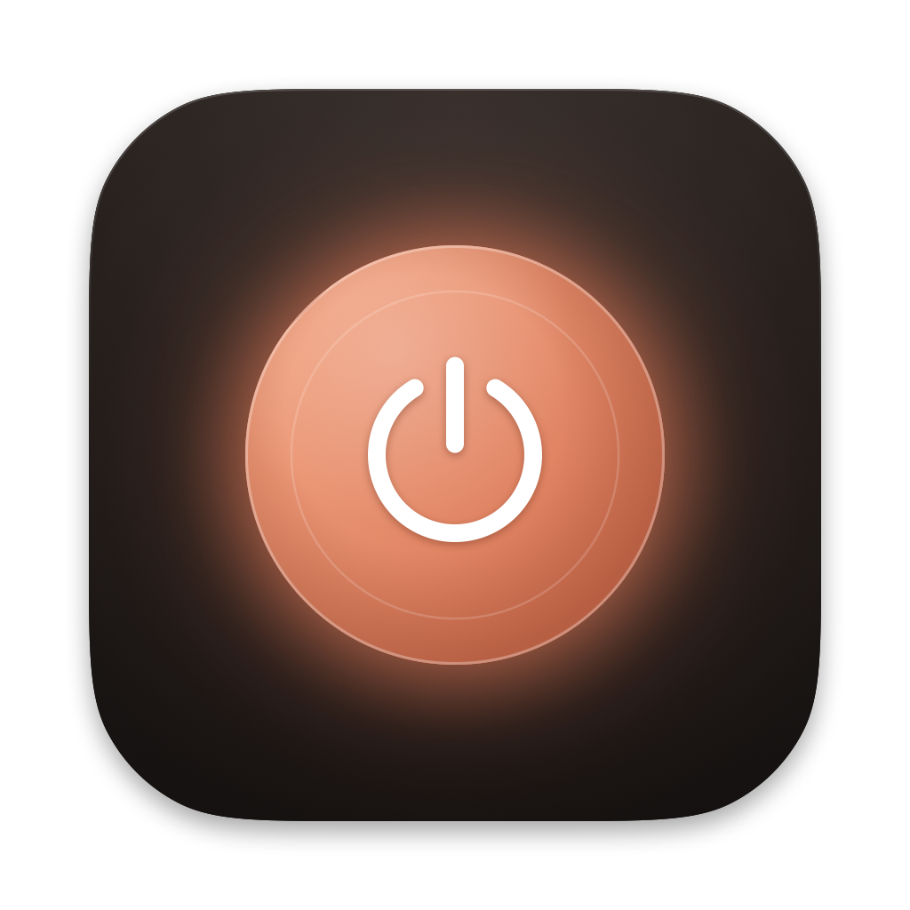
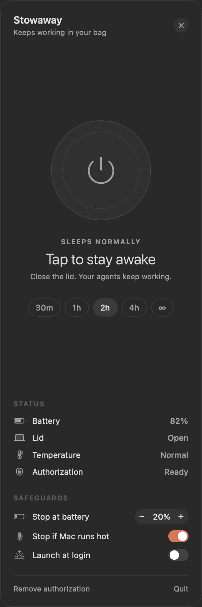
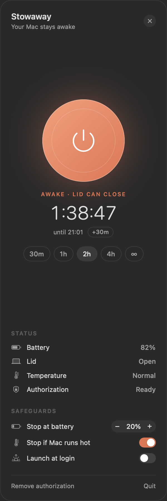

<p align="center">
  
</p>

<h1 align="center">Stowaway</h1>

<p align="center">Keeps working in your bag.</p>

<p align="center">
  
  
  
</p>

Stowaway is a tiny menu bar app that keeps your MacBook awake with the lid closed. It works on battery, with no external display. Close the laptop, put it in your backpack, and long-running jobs keep going: Claude Code sessions, builds, downloads, test suites.

<p align="center">
  
  &nbsp;&nbsp;
  
</p>

## Features

- **One tap.** Click the orb, close the lid, and your Mac stays awake.
- **Auto-off timer.** Choose 30m, 1h, 2h, 4h or no limit. You can extend a running session by 30 minutes.
- **Backpack safeguards.**
  - Normal sleep comes back automatically when the timer ends, when the battery reaches your floor (20% by default), or when macOS reports the Mac is running hot.
  - If the lid is closed when a safeguard trips, the Mac goes to sleep right away.
- **Never stuck awake.**
  - Quitting Stowaway, logging out or shutting down restores normal sleep.
  - After a crash, the next launch restores it.
- **Glanceable.**
  - The menu bar icon shows a moon (🌙) when idle. While Stowaway is keeping the Mac awake, it shows a cup (☕) and the time left.
  - Left-click the icon to open the sidebar. Right-click it to toggle directly.

> **Heat:** a closed laptop in a bag can get warm. Leave **Stop if Mac runs hot** on. It ends the session as soon as macOS reports a serious thermal state.

## Install

With [Homebrew](https://brew.sh):

```bash
brew install --cask SihanCheng0/tap/stowaway
```

Or download `Stowaway-<version>.dmg` from [Releases](https://github.com/SihanCheng0/stowaway/releases) and drag Stowaway to Applications.

> **First launch from the DMG:** releases aren't notarized by Apple yet, so macOS blocks the first launch. Open Stowaway once. Then go to **System Settings → Privacy & Security** and click **Open Anyway**. You do this once for each version you download. Homebrew installs skip this step.

Requires macOS 13 Ventura or later.

## How it works

macOS always sleeps when the lid closes, unless an external display is attached. Apps can't override that with the usual keep-awake APIs (`caffeinate` and power assertions). The one supported switch is `pmset -a disablesleep 1`, and it needs root.

| What | How |
|-|-|
| Keep awake with the lid closed | `pmset -a disablesleep 1` (and `0` to restore) |
| Read the current state | the `SleepDisabled` line of `pmset -g` |
| Battery | IOKit `IOPSCopyPowerSourcesInfo` |
| Lid open or closed | IORegistry `IOPMrootDomain` → `AppleClamshellState` |
| Heat | `ProcessInfo.thermalState` (stops at *serious*) |
| Sleep right away after an auto-stop | `pmset sleepnow` (no root needed) |

This is also why Stowaway isn't on the Mac App Store. Sandboxed apps can't run anything as root.

## Security

The first time you use Stowaway, it asks for your administrator password **once**. That installs a single rule at `/etc/sudoers.d/stowaway`:

```
<you> ALL=(root) NOPASSWD: /usr/bin/pmset -a disablesleep 0, /usr/bin/pmset -a disablesleep 1
```

- **What it allows:** only those two exact commands, only for your user. Nothing else gets passwordless root.
- **How it's installed:** the rule is checked with `visudo` before it's put in place.
- **Why it's needed:** Stowaway won't start a session without it. Without the rule, Stowaway couldn't turn sleep back on by itself while your Mac is in a bag.
- **Removing it:** click **Remove authorization** in the sidebar, or run:

```bash
sudo rm /etc/sudoers.d/stowaway
```

The code that writes the rule is in [`SudoersHelper.swift`](Stowaway/Services/SudoersHelper.swift).

## Privacy

Stowaway collects nothing. Its only network request is a daily check of `api.github.com` for a newer release. The request carries the app's version in its User-Agent header, and the check never downloads anything. If you installed with Homebrew, the update button copies `brew upgrade --cask stowaway` for you.

## Uninstall

- **Homebrew:**
  ```bash
  brew uninstall --zap --cask stowaway
  ```
  `--zap` also removes the sudoers rule and Stowaway's preferences.
- **Manual install:** click **Remove authorization**, quit Stowaway, then move it to the Trash.

## Build from source

```bash
brew install xcodegen
xcodegen generate
xcodebuild -project Stowaway.xcodeproj -scheme Stowaway -configuration Release build
```

To run the tests:

```bash
xcodebuild test -project Stowaway.xcodeproj -scheme Stowaway
```

To also render sidebar snapshots to PNGs, prefix the test command with `TEST_RUNNER_STOWAWAY_SNAPSHOT_DIR=/some/dir`. For a quick unsigned local DMG, run `./build-dmg.sh`.

## Releasing

Releases are ad-hoc signed and not notarized for now.

**Each release:**
1. Bump `MARKETING_VERSION` in `project.yml` and run `xcodegen generate`. Commit `project.yml` and `Stowaway.xcodeproj`, then push.
2. Build the DMG. This also updates the cask's `version` and `sha256` in your `homebrew-tap` checkout (`TAP_DIR`, default `~/Projects/homebrew-tap`).
   ```bash
   scripts/release.sh --unsigned
   ```
3. Publish. This creates a draft GitHub release, pushes the cask, then publishes the release. The release notes include install instructions.
   ```bash
   scripts/publish.sh
   ```

The styled DMG comes from the script set in `DMG_BUILDER`. Set `DMG_BUILDER=none` for a plain `hdiutil` DMG.

**Optional: a stable signature without a developer account.** An ad-hoc signature is different for every build, so `brew upgrade` warns that Stowaway's signer changed. To avoid that, create a self-signed certificate once in Keychain Access → Certificate Assistant → Create a Certificate, with Certificate Type **Code Signing**. Open the certificate and set **Code Signing** to **Always Trust**. Then release with:

```bash
ADHOC_IDENTITY="<certificate name>" scripts/release.sh --unsigned
```

The first upgrade from an ad-hoc release may still show Homebrew's signer-changed warning once.

**Switching to notarized releases** (needs the paid [Apple Developer Program](https://developer.apple.com/programs/)):
1. Create a **Developer ID Application** certificate: Xcode → Settings → Accounts → Manage Certificates → +.
2. Store notarization credentials. You'll need an app-specific password from [account.apple.com](https://account.apple.com).
   ```bash
   xcrun notarytool store-credentials stowaway-notary --apple-id <you@example.com> --team-id <TEAM_ID>
   ```
3. Release without `--unsigned`. The script signs, notarizes and staples the DMG.
   ```bash
   TEAM_ID=<TEAM_ID> scripts/release.sh
   ```
4. Remove the quarantine `postflight_steps` from the cask, and the first-launch note from this README.

## License

[MIT](LICENSE)
